# Cortex-R Agent Architecture Documentation

## Table of Contents
1. [Project Overview](#project-overview)
2. [System Architecture](#system-architecture)
3. [File Structure & Components](#file-structure--components)
4. [Control Flow](#control-flow)
5. [Technology Stack](#technology-stack)
6. [LLM Integration](#llm-integration)
7. [MCP Server Architecture](#mcp-server-architecture)
8. [Memory System](#memory-system)
9. [Component Associations](#component-associations)

---

## Project Overview

**Cortex-R** is a reasoning-driven AI agent that uses external tools and memory to solve complex tasks step-by-step. The agent follows a perception-planning-action loop, where it:

1. **Perceives** the user's intent and selects relevant MCP servers
2. **Plans** a solution using LLM-generated Python code
3. **Executes** the plan in a sandboxed environment with tool access
4. **Learns** from results and maintains session memory

The agent supports multiple MCP (Model Context Protocol) servers, each providing specialized tools for different domains (math, documents, web search, etc.).

---

## System Architecture

### High-Level Architecture Diagram

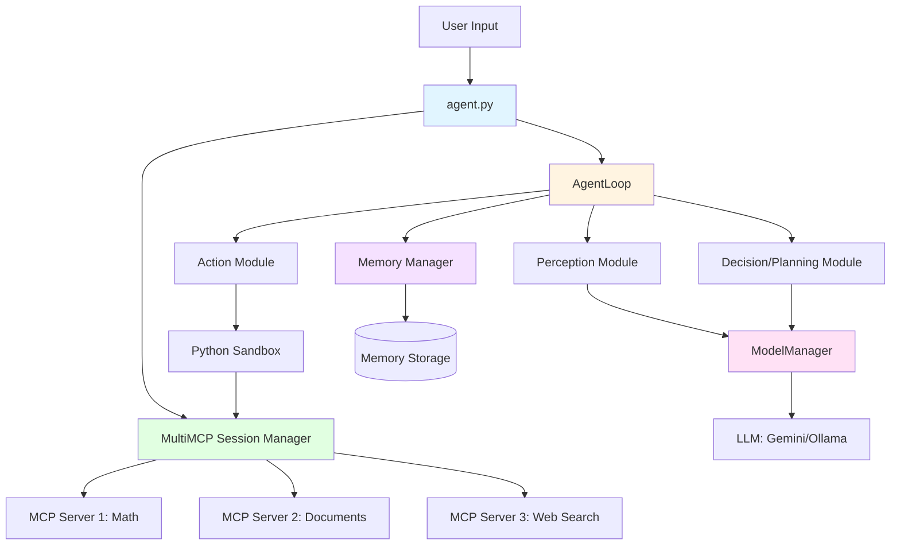

### Component Interaction Flow

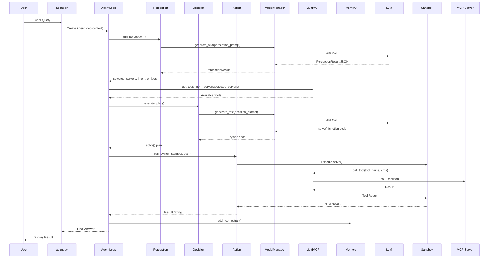

---

## File Structure & Components

### Core Entry Point

#### `agent.py` (81 lines)
**Purpose**: Main entry point and user interaction loop

**Key Responsibilities**:
- Initializes MultiMCP with server configurations from `config/profiles.yaml`
- Manages user input loop (handles 'exit', 'new' commands)
- Creates `AgentContext` for each task
- Instantiates `AgentLoop` and runs the agent
- Handles result parsing (`FINAL_ANSWER:`, `FURTHER_PROCESSING_REQUIRED:`)

**Key Functions**:
- `main()`: Async main loop that handles user input and session management
- `log()`: Simple timestamped console logger

**Dependencies**:
- `core.loop.AgentLoop`
- `core.session.MultiMCP`
- `core.context.AgentContext`

---

### Core Modules (`core/`)

#### `core/loop.py` (247 lines)
**Purpose**: Main agent execution loop implementing perception-planning-action cycle

**Key Responsibilities**:
- Manages step-by-step execution (up to `max_steps`)
- Implements lifeline retry mechanism (`max_lifelines_per_step`)
- Orchestrates perception, planning, and action phases
- Handles sandbox execution and result parsing
- Manages `FURTHER_PROCESSING_REQUIRED` flow with `user_input_override`
- Triggers conversation indexing after final answers
- Handles `ValueError` from planning for retry logic

**Key Classes**:
- `AgentLoop`: Main loop controller

**Key Methods**:
- `run()`: Executes the agent loop with retry logic

**Flow**:
1. For each step (up to max_steps):
   - Run perception to select servers/tools (uses `user_input_override` if available)
   - Generate plan using decision module (includes historical context)
   - Execute plan in sandbox
   - Handle results:
     - `FINAL_ANSWER`: Save to memory, trigger conversation indexing, return success
     - `FURTHER_PROCESSING_REQUIRED`: Update `user_input_override` with formatted content, continue to next step
     - Errors: Retry with lifelines or abort
   - Retry with lifelines if planning fails (catches `ValueError` for invalid `solve()` functions)

**Conversation Indexing**: After each `FINAL_ANSWER`, saves memory, waits briefly, then triggers incremental conversation index update

---

#### `core/session.py` (129 lines)
**Purpose**: MCP server connection and tool management

**Key Classes**:
- `MCP`: Lightweight wrapper for one-time MCP tool calls (stateless)
- `MultiMCP`: Manages multiple MCP servers, discovers tools, routes tool calls

**Key Responsibilities**:
- Initialize connections to multiple MCP servers
- Discover and catalog available tools from all servers
- Map tools to their respective servers
- Route tool calls to correct server
- Maintain tool registry (`tool_map`, `server_tools`)

**Key Methods**:
- `initialize()`: Scans all configured MCP servers and discovers tools
- `call_tool()`: Routes tool call to appropriate server (creates new session per call)
- `get_tools_from_servers()`: Returns tools from selected server IDs

**Architecture Note**: Uses stateless design - each tool call creates a fresh MCP session and closes it after execution.

---

#### `core/context.py` (117 lines)
**Purpose**: Context management and agent configuration

**Key Classes**:
- `StrategyProfile`: Pydantic model for strategy configuration
- `AgentProfile`: Loads and manages agent configuration from YAML
- `AgentContext`: Main context object holding session state

**Key Responsibilities**:
- Load agent profile from `config/profiles.yaml`
- Generate unique session IDs (date-based: `YYYY/MM/DD/session-{timestamp}-{uuid}`)
- Initialize memory manager for session
- Track task progress and subtasks
- Store final answers and user input overrides

**Key Attributes**:
- `user_input`: Original user query
- `agent_profile`: Loaded configuration (strategy, LLM, memory settings)
- `memory`: MemoryManager instance
- `dispatcher`: MultiMCP instance
- `mcp_server_descriptions`: Server configuration dict
- `step`: Current execution step
- `task_progress`: List of tool execution logs
- `final_answer`: Final result string

---

#### `core/strategy.py` (213 lines)
**Purpose**: Strategy selection and plan generation logic

**Key Functions**:
- `select_decision_prompt_path()`: Chooses prompt based on planning/exploration mode
- `decide_next_action()`: Main decision router
- `conservative_plan()`: Single tool call planning
- `exploratory_plan()`: Multi-option planning with memory fallback
- `generate_plan()`: LLM-based plan generation
- `find_recent_successful_tools()`: Memory-based tool selection

**Planning Modes**:
- **Conservative**: Plans exactly one tool call per step
- **Exploratory**: Can plan multiple tool calls (parallel or sequential)

**Memory Fallback**: If planning fails, can fall back to recently successful tools from memory.

---

### Module Components (`modules/`)

#### `modules/perception.py` (92 lines)
**Purpose**: Intent understanding and server selection

**Key Classes**:
- `PerceptionResult`: Pydantic model containing:
  - `intent`: User's intent
  - `entities`: Extracted entities (names, numbers, concepts)
  - `tool_hint`: Suggested tool name
  - `tags`: Classification tags
  - `selected_servers`: List of relevant MCP server IDs

**Key Functions**:
- `extract_perception()`: Uses LLM to analyze user input and select servers
- `run_perception()`: Wrapper that uses context

**Process**:
1. Formats MCP server descriptions from config
2. Loads perception prompt template
3. Calls LLM with user input and server catalog
4. Parses JSON response into `PerceptionResult`
5. Falls back to all servers if parsing fails

---

#### `modules/decision.py` (133 lines)
**Purpose**: Plan generation using LLM with historical context

**Key Functions**:
- `generate_plan()`: Generates `solve()` function code using LLM

**Process**:
1. Loads decision prompt template (based on strategy)
2. Retrieves relevant historical conversations from `ConversationIndexer` (semantic search)
3. Formats prompt with tool descriptions, user input, and historical context
4. Detects if user input contains pre-fetched content (indicated by "Your last tool produced this result:")
5. Adds instructions to process provided content directly without calling tools
6. Calls LLM to generate Python `solve()` function
7. Extracts code from markdown code blocks (handles various formats)
8. Validates that `solve()` function exists (raises `ValueError` if invalid, triggering retry)
9. Returns plan or raises error for retry

**Output Format**: Python async function `async def solve():` that:
- Calls tools via `await mcp.call_tool(tool_name, input_dict)`
- Returns `FINAL_ANSWER: ...` or `FURTHER_PROCESSING_REQUIRED: ...`

**Features**:
- **Historical Context**: Includes relevant past conversations in planning prompt
- **Content Detection**: Automatically detects when content is already provided and instructs LLM to process it directly
- **Robust Extraction**: Handles various LLM output formats, can extract `solve()` from embedded text, and can rename functions to `solve()` as fallback

---

#### `modules/action.py` (85 lines)
**Purpose**: Sandboxed execution of generated plans

**Key Classes**:
- `ToolCallResult`: Pydantic model for tool call results

**Key Functions**:
- `run_python_sandbox()`: Executes generated `solve()` function in isolated environment

**Process**:
1. Creates fresh Python module (`types.ModuleType("sandbox")`)
2. Injects `SandboxMCP` wrapper that:
   - Limits tool calls (MAX_TOOL_CALLS_PER_PLAN = 5)
   - Routes calls to real MultiMCP dispatcher
3. Preloads safe built-ins (`json`, `re`)
4. Executes compiled `solve()` code
5. Handles both sync and async `solve()` functions
6. Formats result as string
7. Catches exceptions and returns error message

**Security**: Sandboxed execution prevents access to filesystem, network (except via tools), and dangerous operations.

---

#### `modules/tools.py` (54 lines)
**Purpose**: Tool utility functions

**Key Functions**:
- `extract_json_block()`: Extracts JSON from markdown code blocks
- `summarize_tools()`: Formats tool list for LLM prompts
- `filter_tools_by_hint()`: Filters tools based on perception hint
- `get_tool_map()`: Creates tool name → tool object mapping
- `load_prompt()`: Loads prompt template files

---

#### `modules/conversation_indexer.py` (429 lines)
**Purpose**: Semantic indexing and search of historical conversations

**Key Classes**:
- `Conversation`: Dataclass representing a historical conversation
  - `session_id`: str
  - `user_query`: str
  - `final_answer`: str
  - `timestamp`: float
  - `tools_used`: List[str]
  - `success`: bool
- `ConversationIndexer`: Manages FAISS-based conversation index

**Key Methods**:
- `_get_embedding()`: Generates embeddings using configured LLM (Ollama/Gemini) or hash-based fallback
- `_load_index()` / `_save_index()`: Persists FAISS index and metadata
- `_extract_conversations_from_session()`: Parses session JSON files to extract `Conversation` objects
- `_scan_memory_files()`: Recursively scans `memory/` directory for session files
- `index_all_conversations()`: Builds or incrementally updates the FAISS index
- `search()`: Performs semantic search on indexed conversations
- `get_relevant_context()`: Formats search results for LLM prompts

**Process**:
1. Scans `memory/` directory for session JSON files
2. Extracts conversations (user query + final answer pairs) from memory files
3. Generates embeddings for each conversation using configured embedding model
4. Stores embeddings in FAISS index with metadata
5. Performs incremental updates (only indexes new sessions)
6. Provides semantic search to find relevant past conversations

**Storage**: 
- `conversation_index/conversations.index`: FAISS index file
- `conversation_index/conversations_metadata.json`: Conversation metadata

**Integration**: Used by `modules/decision.py` to provide historical context in planning prompts

---

#### `modules/model_manager.py` (60 lines)
**Purpose**: LLM abstraction layer

**Key Classes**:
- `ModelManager`: Unified interface for multiple LLM providers

**Supported Providers**:
- **Gemini**: Google's Gemini API (via `google.genai`)
- **Ollama**: Local/remote Ollama instances (via HTTP API)

**Configuration**:
- Loads model config from `config/models.json`
- Loads active model from `config/profiles.yaml` → `llm.text_generation`
- Supports API key from environment variables
- Also used for embeddings (`llm.embedding`) by `ConversationIndexer`

**Key Methods**:
- `generate_text()`: Async text generation (routes to provider-specific method)
- `_gemini_generate()`: Gemini API call
- `_ollama_generate()`: Ollama HTTP POST request

**Usage**:
- **Perception**: Text generation for intent understanding
- **Planning**: Text generation for `solve()` function creation
- **Conversation Indexing**: Embedding generation for semantic search (via `ConversationIndexer`)

---

#### `modules/memory.py` (134 lines)
**Purpose**: Session memory management

**Key Classes**:
- `MemoryItem`: Pydantic model for memory entries
- `MemoryManager`: Manages session memory persistence

**Memory Types**:
- `run_metadata`: Session start/end events
- `tool_call`: Tool invocation logs
- `tool_output`: Tool result logs (with success/failure)
- `final_answer`: Final answers

**MemoryItem Fields**:
- `timestamp`: float
- `type`: str (run_metadata | tool_call | tool_output | final_answer)
- `text`: str (human-readable description)
- `tool_name`: Optional[str]
- `tool_args`: Optional[dict]
- `tool_result`: Optional[dict]
- `final_answer`: Optional[str]
- `tags`: Optional[List[str]]
- `success`: Optional[bool] (key for fallback logic)
- `metadata`: Optional[dict] (includes `user_query` and `session_id` for conversation indexing)

**Key Methods**:
- `add()`: Adds memory item and saves to disk
- `add_tool_call()`: Logs tool invocation
- `add_tool_output()`: Logs tool result with success status
- `add_final_answer()`: Logs final answer
- `find_recent_successes()`: Finds recently successful tools
- `get_session_items()`: Returns all items for current session

**Storage**: JSON files in `memory/YYYY/MM/DD/session-{id}.json`

**Conversation Indexing**: Memory items include `user_query` and `session_id` in metadata for automatic conversation indexing

---

### MCP Servers

#### `mcp_server_1.py` (Math & Computation Server)
**Purpose**: Mathematical operations, string processing, Python sandbox, shell commands

**Key Tools**:
- Math: `add`, `subtract`, `multiply`, `divide`, `power`, `cbrt`, `factorial`, `remainder`, `sin`, `cos`, `tan`, `mine`
- String Processing: `strings_to_chars_to_int`, `int_list_to_exponential_sum`
- Sequences: `fibonacci_numbers`
- Image: `create_thumbnail`
- Execution: `run_python_sandbox`, `run_shell_command`, `run_sql_query`

**Technology**: FastMCP framework, PIL for images, subprocess for shell/SQL

---

#### `mcp_server_2.py` (Documents & Web Server)
**Purpose**: Document processing, RAG, webpage extraction

**Key Tools**:
- `search_stored_documents`: FAISS-based semantic search over document index
- `convert_webpage_url_into_markdown`: Webpage to markdown conversion
- `extract_pdf`: PDF text extraction

**Technology**:
- **FAISS**: Vector similarity search
- **MarkItDown**: Webpage conversion
- **PyMuPDF4LLM**: PDF extraction
- **Ollama**: Embeddings and chunking logic
- **Trafilatura**: Web content extraction

**RAG Pipeline**:
1. Documents chunked and embedded
2. Stored in FAISS index
3. Query embedded and searched
4. Top-K chunks returned

---

#### `mcp_server_3.py` (Web Search Server)
**Purpose**: Internet search and content fetching

**Key Tools**:
- `duckduckgo_search_results`: DuckDuckGo HTML search
- `download_raw_html_from_url`: Raw HTML download

**Technology**:
- **httpx**: Async HTTP client
- **BeautifulSoup**: HTML parsing
- **Rate Limiting**: Prevents API abuse (30 requests/minute)

**Features**:
- Natural language formatted results for LLMs
- Bot detection handling
- Async/await support

---

### Configuration Files

#### `config/profiles.yaml`
**Purpose**: Agent behavior and strategy configuration

**Sections**:
- `agent`: Name, ID, description
- `strategy`: Planning mode, exploration mode, max steps, lifelines
- `memory`: Storage settings, summarization, tagging
- `llm`: Text generation and embedding model selection
- `persona`: Tone, verbosity, behavior tags
- `mcp_servers`: Server configurations (ID, script, cwd, description, capabilities)

---

#### `config/models.json`
**Purpose**: LLM provider configurations

**Models Supported**:
- `gemini`: Google Gemini 2.0 Flash
- `phi4`: Ollama Phi-4
- `gemma3:12b`: Ollama Gemma 3 12B
- `qwen2.5:32b-instruct-q4_0`: Ollama Qwen 2.5 32B
- `nomic`: HuggingFace embedding model

**Structure**: Each model has `type`, `model`, `url` (for Ollama), `api_key_env` (for Gemini)

---

### Prompt Templates (`prompts/`)

#### `prompts/perception_prompt.txt`
**Purpose**: LLM prompt for intent understanding and server selection

**Input**: User query + MCP server catalog
**Output**: JSON with intent, entities, tool_hint, selected_servers

---

#### `prompts/decision_prompt_conservative.txt`
**Purpose**: LLM prompt for generating single-tool-call plans

**Input**: Tool descriptions + user query
**Output**: Python `async def solve():` function with exactly one tool call

**Rules**:
- Must define `async def solve():`
- Call tools using `await mcp.call_tool(tool_name, input_dict)`
- Parse results with `json.loads(result.content[0].text)["result"]`
- Return `FINAL_ANSWER:` or `FURTHER_PROCESSING_REQUIRED:`

---

#### Other Decision Prompts
- `decision_prompt_exploratory_parallel.txt`: Multiple parallel tool calls
- `decision_prompt_exploratory_sequential.txt`: Multiple sequential tool calls
- `decision_prompt_new.txt`: Alternative planning strategy

---

### Data Models

#### `models.py` (175 lines)
**Purpose**: Pydantic models for tool input/output types

**Categories**:
- Math Tools: `AddInput/Output`, `SubtractInput/Output`, etc.
- String/List Tools: `StringsToIntsInput/Output`, `ExpSumInput/Output`, `FibonacciInput/Output`
- Image Tools: `CreateThumbnailInput`, `ImageOutput`
- Execution Tools: `PythonCodeInput/Output`, `ShellCommandInput`
- RAG Tools: `UrlInput`, `FilePathInput`, `MarkdownInput/Output`, `ChunkListOutput`
- Search Tools: `SearchInput`, `SearchDocumentsInput`

**Usage**: Type-safe tool interfaces for MCP servers

---

## Control Flow

### Complete Execution Flow

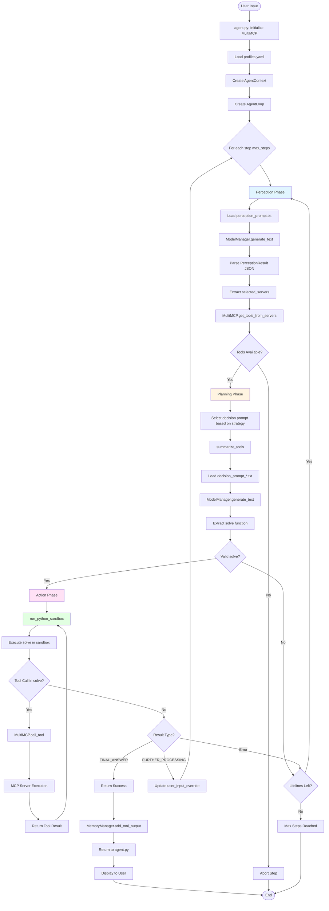

### Detailed Step-by-Step Flow

#### 1. Initialization (agent.py)
```
User Input → Load profiles.yaml → Initialize MultiMCP → Discover Tools → Create AgentContext → Create AgentLoop
```

#### 2. Perception Phase (core/loop.py → modules/perception.py)
```
AgentLoop.run() → run_perception() → extract_perception() → 
Load perception_prompt.txt → Format with server catalog → 
ModelManager.generate_text() → LLM API Call → 
Parse JSON → PerceptionResult (selected_servers, intent, entities)
```

#### 3. Tool Selection (core/loop.py → core/session.py)
```
PerceptionResult.selected_servers → MultiMCP.get_tools_from_servers() → 
Filter tools → summarize_tools() → Tool descriptions string
```

#### 4. Planning Phase (core/loop.py → modules/decision.py)
```
select_decision_prompt_path() → Load decision_prompt_*.txt → 
Format with tool_descriptions + user_input → 
ModelManager.generate_text() → LLM generates solve() function → 
Extract and validate code
```

#### 5. Action Phase (core/loop.py → modules/action.py)
```
run_python_sandbox(plan) → Create sandbox module → 
Inject SandboxMCP wrapper → Execute solve() → 
Tool calls routed to MultiMCP → MCP Server execution → 
Results returned → Format result string
```

#### 6. Result Handling (core/loop.py)
```
Parse result → 
  - FINAL_ANSWER: → Save to memory → Return success
  - FURTHER_PROCESSING_REQUIRED: → Update user_input_override → Continue step
  - Error: → Retry with lifeline or abort
```

#### 7. Memory Persistence (modules/memory.py)
```
Tool calls/results → MemoryManager.add_tool_output() → 
MemoryItem created → Save to JSON file → 
memory/YYYY/MM/DD/session-{id}.json
```

---

## Technology Stack

### Core Technologies

| Technology | Version | Purpose |
|------------|---------|---------|
| **Python** | 3.11+ | Core language |
| **asyncio** | Built-in | Async/await support |
| **Pydantic** | 2.11.3+ | Data validation and models |
| **YAML** | - | Configuration files |
| **JSON** | Built-in | Data serialization |

### LLM Integration

| Provider | Library | Models Supported |
|----------|---------|------------------|
| **Google Gemini** | `google.genai` | gemini-2.0-flash |
| **Ollama** | `requests` (HTTP) | phi4, gemma3:12b, qwen2.5:32b-instruct-q4_0 |
| **HuggingFace** | - | nomic-embed-text-v1 (embeddings) |

### MCP Framework

| Component | Purpose |
|-----------|---------|
| **mcp** | Model Context Protocol SDK |
| **FastMCP** | FastMCP server framework |
| **Stdio Transport** | Process-based communication |

### Document Processing

| Library | Purpose |
|---------|---------|
| **MarkItDown** | Webpage to markdown conversion |
| **PyMuPDF4LLM** | PDF text extraction |
| **Trafilatura** | Web content extraction |
| **FAISS** | Vector similarity search |
| **NumPy** | Numerical operations for embeddings |

### Web & Network

| Library | Purpose |
|---------|---------|
| **httpx** | Async HTTP client |
| **requests** | Synchronous HTTP requests |
| **BeautifulSoup** | HTML parsing |

### Image Processing

| Library | Purpose |
|---------|---------|
| **Pillow (PIL)** | Image manipulation |

### Utilities

| Library | Purpose |
|---------|---------|
| **python-dotenv** | Environment variable management |
| **tqdm** | Progress bars |
| **rich** | Terminal formatting |

---

## LLM Integration

### Model Manager Architecture

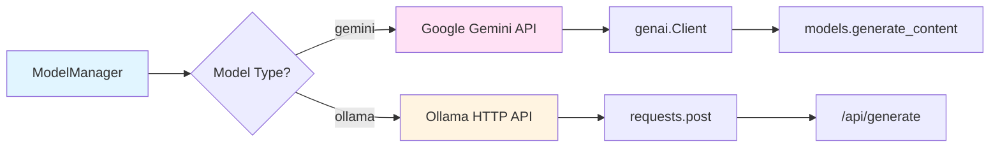

### LLM Usage Points

1. **Perception** (`modules/perception.py`)
   - **Input**: User query + MCP server catalog
   - **Output**: JSON with intent, entities, selected_servers
   - **Model**: Configured in `profiles.yaml` → `llm.text_generation`

2. **Planning** (`modules/decision.py`)
   - **Input**: Tool descriptions + user query + memory items + historical context
   - **Output**: Python `solve()` function code
   - **Model**: Same as perception
   - **Prompt Selection**: Based on `strategy.planning_mode` and `strategy.exploration_mode`
   - **Historical Context**: Includes top-K relevant past conversations from `ConversationIndexer`
   - **Content Detection**: Automatically detects pre-fetched content and instructs LLM to process it directly

3. **Conversation Indexing** (`modules/conversation_indexer.py`)
   - **Input**: Memory files from `memory/` directory
   - **Output**: FAISS index with conversation embeddings
   - **Embedding Model**: Configured in `profiles.yaml` → `llm.embedding` (default: nomic)
   - **Process**: Extracts conversations, generates embeddings, stores in FAISS index
   - **Embedding Generation**: Uses `ModelManager` to generate embeddings for conversation text (user query + final answer)

4. **Document Chunking** (`mcp_server_2.py`)
   - **Input**: Chunk pairs for relatedness check
   - **Output**: Yes/No for chunk merging
   - **Model**: phi4 (Ollama) for chunking decisions

### Prompt Engineering

**Perception Prompt**:
- Structured JSON output requirement
- Server selection logic
- Entity extraction

**Decision Prompt**:
- Strict code generation rules
- Tool call format specification
- Result parsing instructions
- FINAL_ANSWER vs FURTHER_PROCESSING_REQUIRED guidance

---

## MCP Server Architecture

### MCP Server Communication

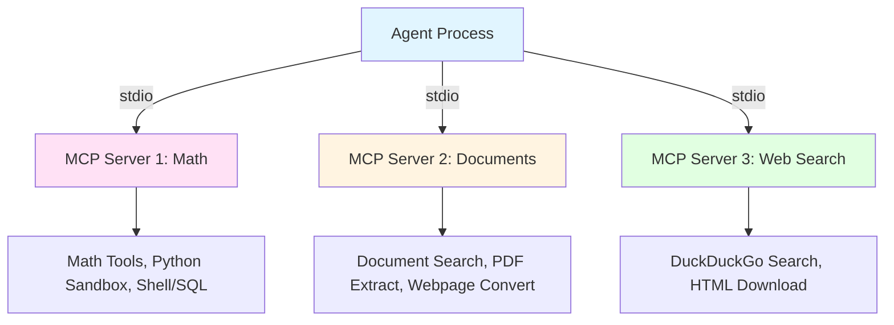

### Server Discovery Flow

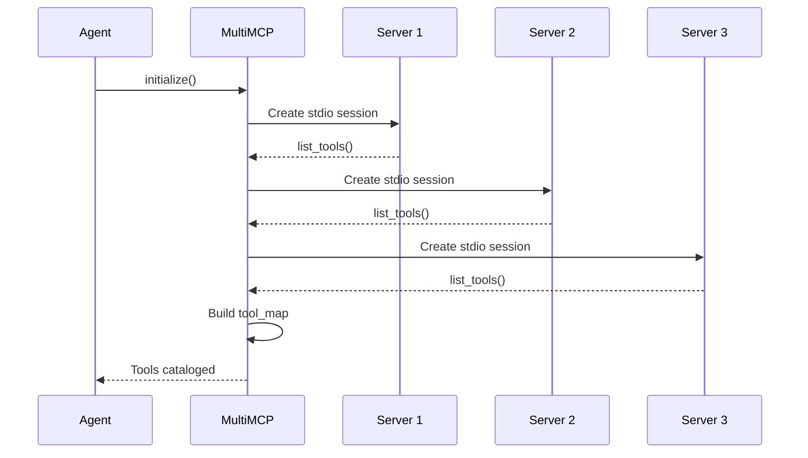

### Tool Call Flow

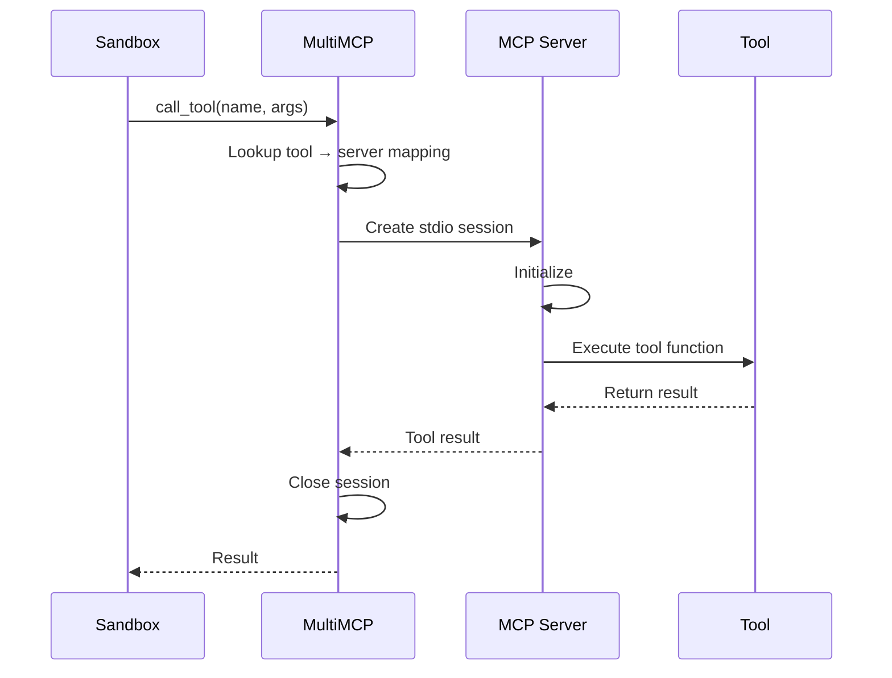

### Stateless Design

**Key Feature**: Each tool call creates a fresh MCP session and closes it after execution.

**Benefits**:
- No persistent connection overhead
- Server crashes don't affect agent
- Easy to scale (stateless servers)

**Trade-offs**:
- Slight latency per call (session creation)
- No session-level state between calls

---

## Memory System

### Memory Architecture

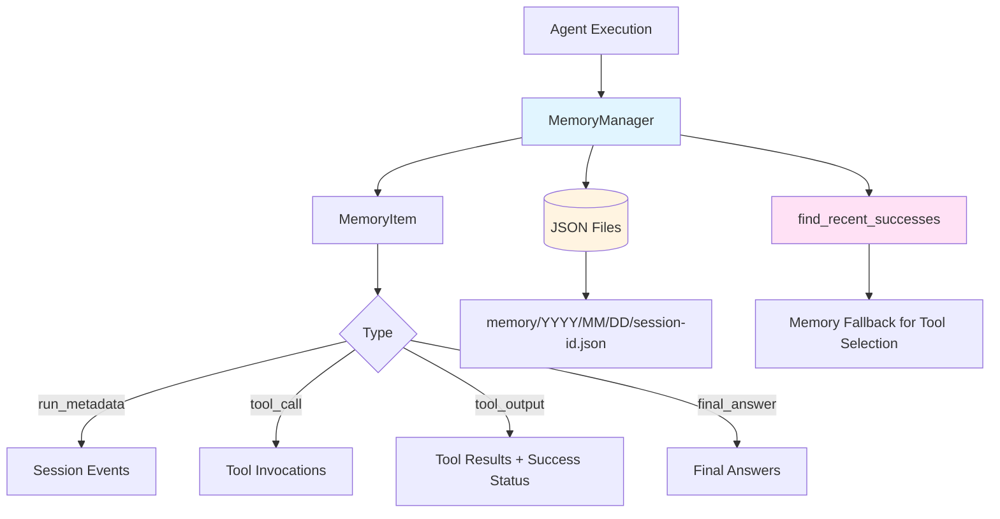

### Memory Item Structure

```python
MemoryItem:
  - timestamp: float
  - type: str (run_metadata | tool_call | tool_output | final_answer)
  - text: str (human-readable description)
  - tool_name: Optional[str]
  - tool_args: Optional[dict]
  - tool_result: Optional[dict]
  - final_answer: Optional[str]
  - success: Optional[bool]  # Key for fallback logic
  - tags: Optional[List[str]]
  - metadata: Optional[dict]  # Includes user_query and session_id for indexing
  - session_id: str (implicit, from file path)
```

### Memory Usage

1. **Session Tracking**: All interactions logged per session
2. **Tool Success Tracking**: Success/failure status for each tool call
3. **Memory Fallback**: Failed planning can use recently successful tools
4. **Conversation Indexing**: Memory files are automatically scanned and indexed for semantic search
5. **Historical Context**: Relevant past conversations are included in planning prompts

### Conversation Indexing System

**Purpose**: Enables the agent to learn from past interactions by providing relevant historical context.

**Architecture**:

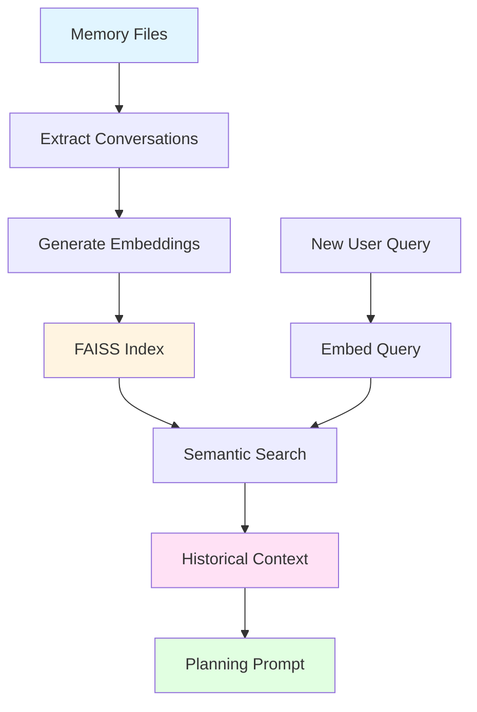

**Features**:
- **Automatic Indexing**: Conversations are indexed incrementally after each interaction
- **Semantic Search**: Uses FAISS vector similarity search to find relevant past conversations
- **Context Injection**: Top-K relevant conversations are included in planning prompts
- **Incremental Updates**: Only new sessions are indexed, avoiding full rebuilds
- **Robust Extraction**: Handles various memory file formats and naming conventions

---

## Component Associations

### Dependency Graph

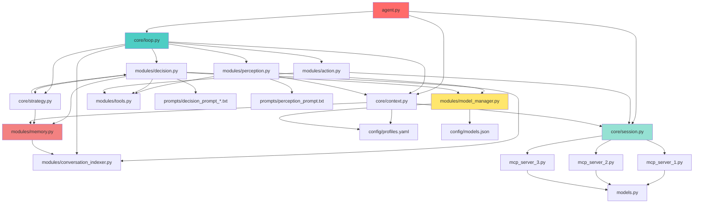

### Data Flow Associations

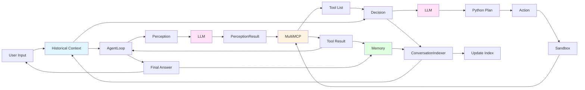

### Configuration Associations

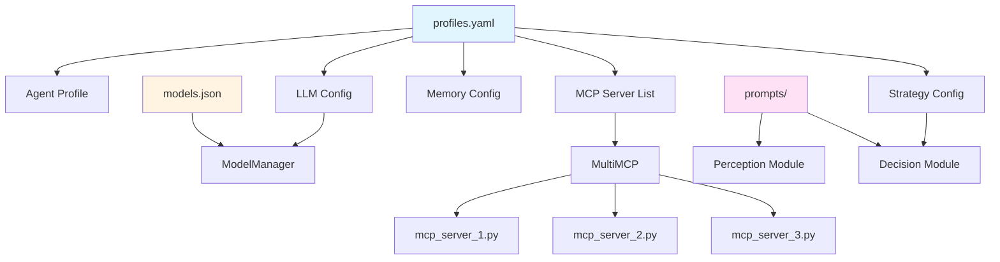

---

## Key Design Patterns

### 1. **Perception-Planning-Action Loop**
Classic AI agent architecture with clear separation of concerns.

### 2. **Strategy Pattern**
Planning mode (conservative/exploratory) selected at runtime via configuration.

### 3. **Factory Pattern**
ModelManager creates appropriate LLM client based on configuration.

### 4. **Adapter Pattern**
SandboxMCP adapts MultiMCP interface for sandboxed execution.

### 5. **Stateless Services**
MCP servers are stateless - each call is independent.

### 6. **Memory Pattern**
Session memory persists across steps for context and fallback.

### 7. **Conversation Indexing Pattern**
Historical conversations are semantically indexed and searched to provide relevant context for new queries.

---

## Error Handling & Resilience

### Retry Mechanisms

1. **Lifelines**: Each step can retry up to `max_lifelines_per_step` times
2. **Memory Fallback**: Failed planning can use successful tools from memory
3. **Server Fallback**: If server selection fails, all servers are used

### Error Types

1. **Perception Errors**: Fallback to all servers
2. **Planning Errors**: Retry with lifelines or memory fallback
   - `ValueError` from invalid `solve()` generation triggers automatic retry
   - Enhanced code extraction handles various LLM output formats
3. **Execution Errors**: Caught in sandbox, returned as error string
4. **Tool Errors**: Propagated through MCP, handled in sandbox
5. **Indexing Errors**: Conversation indexing failures are logged but don't block agent execution

---

## Future Enhancements

### Potential Improvements

1. **Persistent MCP Sessions**: Reduce latency with connection pooling
2. **Streaming Responses**: Real-time LLM output streaming
3. **Multi-Model Support**: Use different models for perception vs planning
4. **Enhanced Memory**: Semantic search over memory items (✅ **Implemented**: Conversation indexing)
5. **Tool Caching**: Cache tool results for repeated queries
6. **Parallel Tool Execution**: Execute independent tools concurrently
7. **Web UI**: Browser-based interface for agent interaction
8. **Conversation Indexing**: ✅ **Implemented** - Semantic search over historical conversations

---

## Conclusion

Cortex-R is a well-architected AI agent system that demonstrates:

- **Modularity**: Clear separation between perception, planning, and action
- **Extensibility**: Easy to add new MCP servers and tools
- **Flexibility**: Configurable strategies and LLM providers
- **Robustness**: Error handling, retries, and memory fallback
- **Type Safety**: Pydantic models throughout

The architecture supports complex multi-step reasoning tasks while maintaining clean code organization and extensibility.

---

*Document generated for Cortex-R Agent v0.1.0*

**Recent Updates**:
- ✅ Added conversation indexing system for learning from past interactions
- ✅ Enhanced planning with historical context integration
- ✅ Improved error handling with `ValueError` retry mechanism
- ✅ Robust code extraction for various LLM output formats
- ✅ Automatic conversation indexing after each interaction

